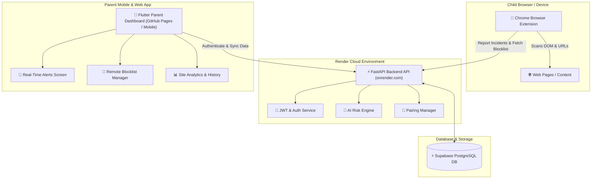

<div align="center">

# 🛡️ SafeGuard AI — Real-Time Child Safety & Browsing Protection

### AI-Powered Web Content Scanner, Real-Time Alert System, Remote Blocklist Manager & Parent Analytics Dashboard

[](https://maheshdakulge.github.io/safeguard_ai_live/)
[](https://safeguard-api.onrender.com/)
[](#-chrome-extension-installation--pairing-guide)
[](https://github.com/MaheshDakulge/safeguard_ai_live)

---


</div>

---

## 🌟 Live Demo & Quick Links

| Component | Description | Live Access / Link |
| :--- | :--- | :--- |
| 🚀 **Web App / Parent Dashboard** | Cross-platform Flutter Web application for parents to monitor browsing safety, review high-risk alerts, manage blocklists, and check extension status. | **[Launch Live Web Dashboard](https://maheshdakulge.github.io/safeguard_ai_live/)** |
| ⚡ **Render Backend API** | FastAPI REST backend hosted on Render, handling JWT auth, pairing code generation, incident risk scoring, and Supabase database sync. | **[API Health Endpoint](https://safeguard-api.onrender.com/)** |
| 🧩 **Chrome Browser Extension** | Lightweight Chrome Extension that runs in the child's browser, monitors page activity, blocks restricted domains, and sends alerts to Render API. | **[Extension Source / Files](https://github.com/MaheshDakulge/safeguard_ai_live)** • **[Installation Guide](#-chrome-extension-installation--pairing-guide)** |
| 📦 **GitHub Repository** | Complete open-source codebase for Flutter frontend, backend services, and deployment workflows. | **[GitHub Source Code](https://github.com/MaheshDakulge/safeguard_ai_live)** |

---

## 💡 System Overview & Core Features

**SafeGuard AI** is a comprehensive multi-platform solution designed to protect children from harmful online content while giving parents real-time visibility and control over web activity.

### ✨ Key Features

1. **🔔 Real-Time Incident Alert System**:
   - Auto-categorizes web activity into **HIGH**, **MEDIUM**, and **LOW** risk levels.
   - High-risk incidents trigger instant parent notifications with unreviewed badge counters.
   - One-tap incident review and detailed content snippets.

2. **🔑 Device Pairing via Unique Code**:
   - Secure 6-digit pairing code generation per account.
   - Seamlessly pairs the parent's mobile/web app with the child's Chrome Extension.
   - Live extension connectivity status indicator (**Active**, **Idle**, **Disconnected**, or **Not Paired**).

3. **🚫 Remote Dynamic URL Blocklist Manager**:
   - Add or remove domains from the blocked list remotely from the parent dashboard.
   - Categorize blocks (e.g. *Adult Content*, *Gaming*, *Social Media*, *Custom*).
   - Chrome Extension automatically fetches updated blocklists in the background every few seconds.

4. **📊 Web Analytics & Site Breakdown**:
   - Deep insights into top visited websites, time distribution, and safety ratings.
   - Historical log searching, filtering by risk level and review status.

5. **🔐 Multi-Tenant Authentication & Privacy**:
   - JWT-based authentication backed by Supabase DB.
   - Encrypted token storage (`SharedPreferences`) with automated session revocation.

---

## 🏗️ System Architecture



---

## 🧩 Chrome Extension Installation & Pairing Guide

Follow these simple steps to install, configure, and pair the SafeGuard Chrome Extension on your child's laptop or desktop browser.

### 📥 Step 1: Install the Extension in Google Chrome

1. Open **Google Chrome** on the child's computer.
2. Navigate to `chrome://extensions/` in the address bar.
3. Toggle ON **Developer mode** in the top right corner.
4. Click the **Load unpacked** button in the top left.
5. Select your `safeguard_extension` folder containing `manifest.json`.

---

### 🔑 Step 2: Get your 6-Digit Pairing Code

1. Launch the **[SafeGuard Live Web Dashboard](https://maheshdakulge.github.io/safeguard_ai_live/)** (or mobile app).
2. Log in or create your parent account.
3. On the **Home** dashboard tab, locate your unique **Pairing Code** (e.g. `849201`).

---

### 🔗 Step 3: Connect Extension to Render Backend

1. Click the **SafeGuard puzzle piece / extension icon** in the Chrome toolbar.
2. Enter the backend service configuration:
   - **Render API URL**: `https://safeguard-api.onrender.com`
   - **6-Digit Pairing Code**: *(Enter your code from Step 2)*
3. Click **Connect & Protect**.

---

### ✅ Step 4: Verify Live Protection

- Once connected, the extension badge will show **PROTECTED 🟢**.
- Return to your **SafeGuard Parent Dashboard**:
  - The Extension status will switch to **Active 🟢**.
  - Any unsafe websites or high-risk content visited on the child's browser will instantly trigger an alert on the parent's dashboard!

---

## 🚀 Live Deployment Guide

### 1️⃣ Deploying Backend to Render

1. Log in to **[Render Dashboard](https://dashboard.render.com)**.
2. Click **New +** > **Web Service**.
3. Connect your GitHub repository (`safeguard_ai_live` or backend repo).
4. Configure service settings:
   - **Name**: `safeguard-api`
   - **Environment**: `Python 3` or `Docker`
   - **Build Command**: `pip install -r requirements.txt`
   - **Start Command**: `uvicorn app.main:app --host 0.0.0.0 --port $PORT`
5. Add **Environment Variables**:
   - `SUPABASE_URL`: `your-supabase-url`
   - `SUPABASE_KEY`: `your-supabase-anon-or-service-key`
   - `JWT_SECRET`: `your-secure-jwt-secret`
6. Click **Create Web Service**. Your live backend URL will be ready at `https://safeguard-api.onrender.com`.

---

### 2️⃣ Deploying Web Application to GitHub Pages

1. **Push your repository to GitHub**:
   ```bash
   git add .
   git commit -m "Update extension setup guide and GitHub Pages config"
   git push
   ```

2. **Automated Deployment**:
   - GitHub Actions automatically executes [.github/workflows/deploy-web.yml](file:///.github/workflows/deploy-web.yml) to compile the Flutter Web app.
   - Go to your GitHub repository **Settings** > **Pages**.
   - Under **Build and deployment**, set **Source** to `GitHub Actions` (or select branch `gh-pages`).
   - Click **Save**.

3. **Access Live Web App**:
   Your live dashboard will be published at:
   👉 **`https://maheshdakulge.github.io/safeguard_ai_live/`**

---

## 💻 Local Development Setup

### Prerequisites
- [Flutter SDK](https://docs.flutter.dev/get-started/install) (v3.19+)
- [Dart SDK](https://dart.dev/get-dart)
- Chrome Browser

### Steps

1. **Clone the repository**:
   ```bash
   git clone https://github.com/MaheshDakulge/safeguard_ai_live.git
   cd safeguard_ai_live
   ```

2. **Install dependencies**:
   ```bash
   flutter pub get
   ```

3. **Run on Chrome (Web)**:
   ```bash
   flutter run -d chrome --dart-define=API_URL=https://safeguard-api.onrender.com
   ```

4. **Run on Mobile Emulator / Physical Device**:
   ```bash
   flutter run
   ```

---

## 🛠️ Tech Stack & Dependencies

- **Frontend**: Flutter (Dart), Material Design 3, Google Fonts, HTTP, SharedPreferences
- **Backend API**: FastAPI, Uvicorn, Pydantic, Python-JOSE (JWT), PyMuPDF, Pandas
- **Database**: Supabase (PostgreSQL), Row Level Security (RLS)
- **Extension**: Chrome Extension Manifest V3, JavaScript, Background Service Workers
- **DevOps & Hosting**: Render (Backend Web Service), GitHub Actions (CI/CD), GitHub Pages (Hosting)

---

<div align="center">

Made with ❤️ for child online safety.

</div>
